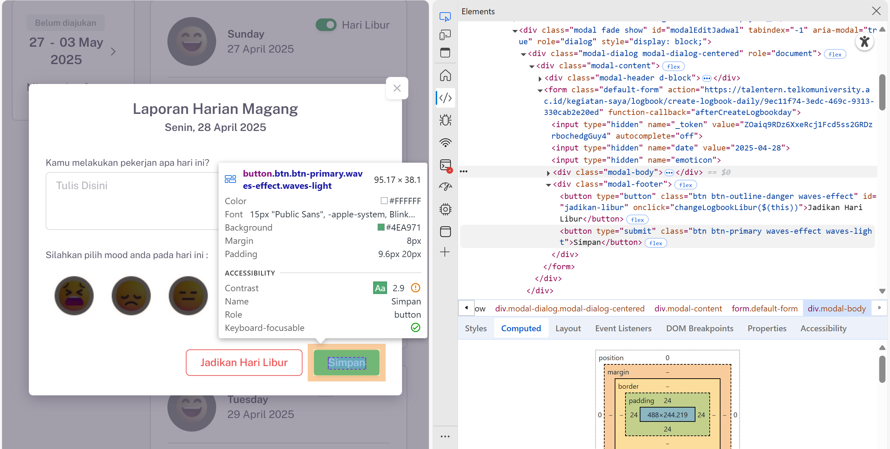
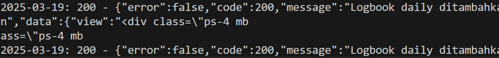
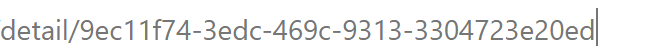

Untuk mendapatkan Cookies `talentern_session` dari browser, ikuti langkah berikut:

1. **Login ke website** Talentern di browser (Google Chrome/Edge).
2. **Buka halaman logbook** (halaman yang ada form input logbook).
3. **Tekan F12** untuk membuka Developer Tools.
4. Pilih tab **Application** (atau Storage di Firefox).
5. Di sidebar kiri, klik **Cookies** lalu pilih domain `https://talentern.telkomuniversity.ac.id`.
6. Cari nama cookie **`laravel_session`**.
7. **Salin** nilai (value) dari kolom `talentern_session`.
8. Tempelkan nilai tersebut ke kode Python Anda:

```python
cookies = {
    "talentern_session": "NILAI_YANG_DISALIN_DARI_BROWSER"
}
```

**Catatan:**  
Nilai cookie ini hanya berlaku selama Anda masih login di browser. Jika logout atau session expired, Anda harus mengambil ulang.

Cara Mengambil Token untuk mengisi variabel "\_token" :


## Cara Menggunakan Script

1. **Pastikan sudah mengisi variabel `_token` dan `talentern_session`** pada file `main.py` sesuai petunjuk di atas.
2. **Edit data pada list `activities`** di file `main.py` sesuai kebutuhan logbook Anda.
3. **Install library yang dibutuhkan** (jika belum):
   ```sh
   pip install requests
   ```
4. **Jalankan script di terminal**:
   ```sh
   python main.py
   ```
5. **Cek hasil pengiriman** pada output terminal. Jika berhasil, status code akan 200/201.

---

**Catatan:**

- Pastikan token dan session masih aktif saat menjalankan script.
- Jika terjadi error 419/Page Expired, ulangi proses pengambilan token dan session.
- Jika seperti ini, maka sudah berhasil  dan sesuaikan kembali Tanggal/Link Code/Activity untuk mengisi logbook lewat sini.

---

## Code dari alamat: 
